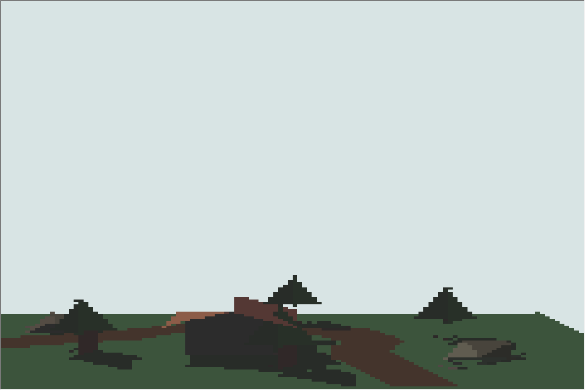

# Game-Boy-Advance-3D-Rail-Shooter
Very much W.I.P.  
  
A 3d rendered rail shooter game for the game boy advance, inspired by Star Fox. This project combines C++ and ARM assembly.  

# Compiling:
Download and install DevKitPro: https://github.com/devkitPro/installer/releases  
Make sure DevKitPro is added to the enviourment variables.  
Run the included make file to ouput a .gba file.  
Use an game boy advance emulater to run the .gba file. The project has been tested on no$gba.  
